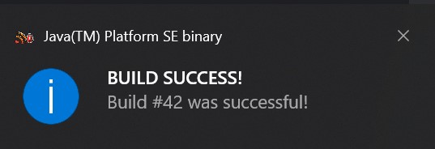

# Feed-Alert

Will show an alert when the title of the first entry of a rss feed changes.  
This is a very simple solution for webapps to notify about changes.  

This is the add entry dialog:  
  

And this is the notification:  
